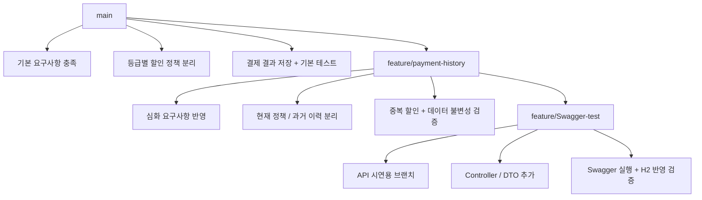

# Polycube Payment System

> 이 프로젝트는 단순히 결제 기능을 구현하는 과제가 아닌,  
> **변경될 수 있는 할인 정책을 어떻게 다루고, 과거 결제 데이터를 어떻게 안정적으로 보존할 것인지**를 설계로 풀어내는 데 초점을 맞춘 프로젝트입니다.

---

## 1. 프로젝트 개요

이 과제를 진행하면서 가장 중요하다고 생각한 것은 “기능을 얼마나 많이 넣었는가”보다  
**왜 이런 구조로 설계했는가**를 분명하게 보여주는 것이라고 생각합니다.

기본 요구사항만 보면 비교적 단순한 결제 시스템처럼 보일 수 있지만,  
심화 요구사항까지 포함해서 보면 할인 정책이 자주 바뀌는 상황에서  
과거 결제 데이터와 이력을 어떻게 보존할 것인지가 핵심이라고 판단했습니다.

그래서 처음부터 모든 요구사항을 하나의 구조 안에 억지로 담기보다는,

- `main` 브랜치에서는 기본 요구사항을 충실하게 구현하고
- `feature/payment-history` 브랜치에서는 main 구조의 한계를 보완하는 방향으로 확장하고
- `feature/Swagger-test` 브랜치에서는 구현 결과를 API 레벨에서 직접 검증하는 흐름을 추가하는 방식

으로 프로젝트를 구성했습니다.

즉, 이 프로젝트는 단순히 “무엇을 만들었는가”보다  
**main에서 feature로 어떻게 설계가 발전했는가**를 보여주기 위해 만든 과제입니다.

---

## 2. 기술 스택

- Java 17
- Spring Boot 3.x
- Spring Data JPA
- H2 Database (in-memory)
- Lombok
- JUnit5

---

## 3. 브랜치 전략

| 브랜치 | 역할 |
|--------|------|
| `main` | 기본 요구사항 구현 |
| `feature/payment-history` | 심화 요구사항 구현 및 설계 확장 |
| `feature/Swagger-test` | API 실행 및 H2 반영 검증용 브랜치 |

브랜치를 이렇게 나눈 이유는 각 요구사항의 성격이 다르다고 판단했기 때문입니다.

- `main` 브랜치에서는 **기본 요구사항을 정확하게 충족하는 것**에 집중했습니다.
- `feature/payment-history` 브랜치에서는 **정책 변경 가능성, 이력 보존, 중복 할인**까지 고려해 구조를 확장했습니다.
- `feature/Swagger-test` 브랜치는 제출 브랜치를 대체하는 것이 아니라, 이미 구현한 내용을 **API와 H2 DB 레벨에서 직접 검증하기 위한 보조 브랜치**입니다.

즉, 이 프로젝트는 처음부터 모든 요구사항을 하나의 구조에 한꺼번에 담기보다,  
**기본 요구사항을 만족하는 구조에서 시작해 심화 요구사항에 맞게 설계를 발전시키는 방식**으로 진행했습니다.

각 브랜치는 같은 기능을 반복해서 구현한 것이 아니라,  
**기본 요구사항 구현 → 심화 요구사항 확장 → API 검증 레이어 추가**라는 흐름으로 역할을 분리했습니다.



---

## 4. main 브랜치 설계

### 4.1 설계 방향

`main` 브랜치는 **기본 요구사항을 정확하게 충족하는 것**을 가장 우선순위로 두고 설계했습니다.

과제 평가 기준상 Architecture도 중요하지만,  
기본 요구사항 단계에서부터 과도한 구조를 넣는 것은 오히려 복잡도를 높일 수 있다고 판단했습니다.

그래서 `main`에서는

- 회원 등급별 할인 정책 적용
- 결제 결과 저장
- 기본 예외 처리
- 핵심 비즈니스 규칙 테스트

까지를 명확하게 구현하는 데 집중했습니다.

즉, `main`은 **기본 요구사항을 충실히 만족하는 기준 구현 브랜치**이고,  
이후 심화 요구사항은 `feature/payment-history`에서 별도로 확장하는 방향을 택했습니다.

---

### 4.2 도메인 구성

주요 도메인은 아래와 같습니다.

- `Member`
- `Order`
- `Payment`

#### Member
회원은 `NORMAL`, `VIP`, `VVIP` 중 하나의 등급을 가집니다.

#### Order
주문은 상품명, 원가, 회원 정보를 가집니다.

#### Payment
결제는 주문과 연결되며, 결제 결과를 저장합니다.

저장 정보는 다음과 같습니다.

- `originalAmount`
- `discountAmount`
- `finalAmount`
- `paymentMethod`
- `paidAt`

이 구조를 통해 결제 당시 원금, 할인 금액, 최종 결제 금액을 확인할 수 있도록 했습니다.

---

### 4.3 할인 정책 구조

main 브랜치에서는 회원 등급별 할인 정책을 각각 분리해서 구현했습니다.

- `DiscountPolicy`
- `NormalDiscountPolicy`
- `VipDiscountPolicy`
- `VvipDiscountPolicy`
- `DiscountPolicyResolver`
- `DiscountService`

구조적으로는 할인 정책을 하나의 if-else 로직으로 처리하기보다,
등급별 정책 클래스로 분리한 뒤 `DiscountPolicyResolver`가 회원 등급에 맞는 정책을 선택하도록 구성했습니다.

```text
DiscountPolicy
├── NormalDiscountPolicy
├── VipDiscountPolicy
└── VvipDiscountPolicy
```
이 방식은 기본 요구사항을 만족하는 데 충분했고,
할인 로직을 정책 단위로 분리했다는 점에서 main 브랜치의 설계 의도를 잘 드러낸다고 봤습니다.

### 4.4 결제 처리 방식

`main` 브랜치의 결제 흐름은 비교적 단순합니다.

1. 주문 조회
2. 회원 등급에 따른 할인 금액 계산
3. 최종 결제 금액 계산
4. `Payment` 저장

이때 할인 로직은 회원 등급 기준으로만 동작합니다.

- `NORMAL` → 0원 할인
- `VIP` → 1,000원 할인
- `VVIP` → 주문 금액의 10% 할인

`main`에서 중요하게 본 것은  
기본 요구사항 수준에서는 **결제 결과를 정확하게 저장하는 것**이었습니다.

즉, “정책의 상세 이력”보다  
“결제 결과 자체를 일관되게 남기는 것”에 우선순위를 두었습니다.

### 4.5 테스트 전략

`main` 브랜치에서는 기본 비즈니스 규칙이 제대로 동작하는지 검증하는 데 집중했습니다.

#### `DiscountPolicyTest`

- `NORMAL` 회원은 할인되지 않는지
- `VIP` 회원은 1,000원 할인되는지
- `VVIP` 회원은 10% 할인되는지
- `VIP` 할인은 주문 금액을 초과하지 않는지

#### `PaymentServiceTest`

- `NORMAL` 회원 결제가 정상 처리되는지
- `VIP` 회원 결제가 정상 처리되는지
- `VVIP` 회원 결제가 정상 처리되는지
- 결제 수단(`CREDIT_CARD`, `POINT`)이 정상 반영되는지

여기서 테스트는 단순히 메서드 호출 여부를 확인하는 것이 아니라,  
등급별 할인 규칙과 결제 결과가 정확히 반영되는지 검증하는 역할을 했습니다.

### 4.6 예외 처리 설계

`main` 브랜치에서는(`main`말고 나머지 브랜치들도 해당합니다.)  기본 요구사항을 구현하는 과정에서도  
예외 상황을 단순히 런타임 오류에 맡기지 않고,  
의미 있는 비즈니스 예외로 분리해서 다루고자 했습니다.

관련 구성은 다음과 같습니다.

- `ErrorCode`
- `BusinessException`
- `NotFoundException`

예를 들어 아래와 같은 예외 코드를 정의했습니다.

- `ORDER_NOT_FOUND` : 주문을 찾을 수 없는 경우
- `DISCOUNT_POLICY_NOT_FOUND` : 회원 등급에 맞는 할인 정책을 찾을 수 없는 경우
- `INVALID_PAYMENT_AMOUNT` : 유효하지 않은 결제 금액인 경우

이 구조를 둔 이유는 단순합니다.

1. 예외 상황을 문자열이나 즉흥적인 방식으로 처리하지 않고,
2. 비즈니스 규칙 위반을 명확한 코드와 메시지로 표현하고,
3. 이후 예외 응답 정책이나 API 응답 구조로 확장하기 쉽도록 하기 위해서입니다.

즉, 예외 처리 역시 단순 방어 코드가 아니라  
**도메인 규칙을 명확하게 표현하는 설계 요소**로 보았습니다.

## 5. main 구조의 한계

`main` 브랜치는 기본 요구사항을 만족시키는 데는 충분했지만,  
심화 요구사항까지 고려하면 구조적인 한계가 분명했습니다.

### 5.1 어떤 정책이 적용됐는지 남기지 못함

`main`에서는 결제 결과로 `discountAmount`만 저장합니다.

즉,

- 어떤 정책이 적용되었는지
- 그 정책이 정액 할인인지 정률 할인인지
- 어떤 기준으로 할인되었는지

를 별도로 남기지 못합니다.

결과적으로 “얼마 할인됐는지”는 알 수 있지만,  
왜 그렇게 할인됐는지를 나중에 설명하기는 어렵습니다.

### 5.2 현재 정책과 과거 결제 시점이 분리되어 있지 않음

`main` 구조에서는 현재 시스템에 존재하는 할인 규칙과  
과거 결제 당시 적용된 할인 규칙이 사실상 분리되어 있지 않습니다.

이 구조에서는 정책이 바뀌었을 때 과거 결제를 해석하는 데 한계가 있습니다.

예를 들어,

- `VIP` 할인 금액이 1,000원에서 2,000원으로 변경되거나
- 특정 정책이 삭제되거나
- 결제 수단 할인 같은 추가 정책이 생기면

이미 저장된 결제 데이터만으로는  
과거 시점에 어떤 정책이 적용되었는지 설명하기 어려워집니다.

### 5.3 중복 할인 구조가 없음

`main`에서는 할인 정책을 회원 등급 기준으로만 처리합니다.

그래서 다음과 같은 요구사항이 들어오면 구조가 자연스럽지 않게 됩니다.

- 특정 결제 수단일 때 추가 할인
- 여러 할인 정책을 순서대로 중복 적용
- 할인 정책별 이력 저장

즉, `main`은 기본 요구사항을 만족하는 단순한 구조이지만,  
정책이 자주 바뀌고 조합이 늘어나는 상황을 버티기에는 부족했습니다.

### 5.4 `main`브랜치(기본 요구 사항)에 대한 정리

결국 `main` 브랜치는 아래와 같은 성격을 가집니다.

- 기본 요구사항을 구현하는 데는 적절함
- 구조가 단순하고 이해하기 쉬움
- 하지만 정책 변경 이력과 데이터 불변성까지 다루기에는 한계가 있음

그래서 다음 단계에서는  
단순한 결제 결과 저장을 넘어서,  
현재 정책과 과거 결제 시점 이력을 분리하는 방향으로 설계를 확장하게 되었습니다.

## 6. feature/payment-history 브랜치 설계 개선

`feature/payment-history` 브랜치는  
`main`에서 구현한 **기본 요구사항을 바탕으로**,  
과제의 **심화 요구사항을 해결하기 위해 확장한 브랜치**입니다.

이 브랜치에서는 특히 아래 요구사항을 해결하는 데 집중했습니다.

- 할인 정책 변경/삭제 후에도 과거 결제 이력 보존
- 결제 시점 할인 이력 저장
- `POINT` 결제 시 5% 추가 할인
- 중복 할인 적용 결과 검증
- 정책 변경 후 데이터 정합성 검증

즉, `main`이 기본 요구사항을 충족하는 기준 구현이라면,  
`feature/payment-history`는 **운영 환경에서 발생할 수 있는 정책 변화까지 고려한 심화 설계 브랜치**라고 볼 수 있습니다.

### 6.1 왜 설계를 바꿨는가

심화 요구사항을 보면 핵심은 단순히 할인 하나를 더 추가하는 것이 아니었습니다.

오히려 더 중요한 문제는 아래 두 가지였습니다.

- 할인 정책은 계속 바뀔 수 있다.
- 그런데 과거 결제 데이터는 바뀌면 안 된다.

이 두 조건을 동시에 만족하려면  
현재 정책만 저장해서는 부족했습니다.

그래서 `feature` 브랜치에서는

- 현재 운영 정책을 저장하는 구조
- 결제 시점에 적용된 결과를 스냅샷처럼 남기는 구조

를 분리해서 가져갔습니다.

### 6.2 현재 운영 정책 엔티티

현재 시스템에서 사용 중인 할인 정책은 `DiscountPolicyEntity`로 관리했습니다.

관련 구성은 다음과 같습니다.

- `DiscountPolicyEntity`
- `DiscountType` (`FIXED`, `RATE`)
- `DiscountCategory` (`GRADE`, `PAYMENT_METHOD`)
- `DiscountPolicyRepository`

이 엔티티는 현재 운영 중인 할인 정책 자체를 나타냅니다.

예를 들어 아래와 같은 정책을 저장할 수 있습니다.

- `VIP` 회원 고정 1,000원 할인
- `VVIP` 회원 10% 할인
- `POINT` 결제 시 5% 추가 할인

즉, `DiscountPolicyEntity`는  
“지금 시스템에서 어떤 정책이 살아 있는가”를 표현하는 역할을 합니다.

### 6.3 결제 시점 할인 이력 엔티티

현재 정책과 별도로,  
결제 시점에 실제로 어떤 할인이 적용되었는지는 `AppliedDiscountHistory`에 저장했습니다.

관련 구성은 다음과 같습니다.

- `AppliedDiscountHistory`
- `AppliedDiscountHistoryRepository`

이력에는 아래 정보가 저장됩니다.

- 할인 구분
- 정책명
- 적용 회원 등급
- 적용 결제수단
- 할인 타입
- 할인값
- 실제 할인 금액

이 구조에서 가장 중요하게 본 점은  
`AppliedDiscountHistory`가 현재 정책 엔티티를 직접 참조하지 않는다는 것입니다.

즉,

- 정책 값이 나중에 바뀌더라도
- 정책이 비활성화되더라도
- 운영 정책이 더 이상 존재하지 않더라도

과거 결제 이력은 그대로 남아 있게 됩니다.

이렇게 해야 결제 시점의 할인 결과를  
나중에도 안정적으로 설명할 수 있다고 봤습니다.

---

### 6.4 계산, 조회, 이력 저장 책임 분리

`main`에서는 `PaymentService`가 할인 계산까지 직접 담당하는 구조였습니다.

하지만 feature에서는 책임을 더 명확히 나누었습니다.

- `DiscountPolicyReader` → 현재 정책 조회
- `DiscountCalculator` → 할인 계산
- `DiscountHistoryService` → 할인 이력 저장

그리고 기존 정책 구조는 유지하면서,
그 위에 현재 정책 조회와 계산 결과 관리 책임을 확장하는 방향으로 설계를 발전시켰습니다.

즉, `feature/payment-history`는
정책 구현체 자체를 완전히 다른 구조로 갈아엎었다기보다,
기존 `main` 구조 위에 운영 정책 관리와 이력 보존 책임을 추가한 형태에 가깝습니다.

그래서 `feature/payment-history`에서는 결제 흐름을 아래처럼 분리했습니다.

1. 주문 조회
2. 현재 할인 정책 조회
3. 할인 계산
4. `Payment` 저장
5. 할인 이력 저장

이 구조로 바꾸면서 각 역할이 훨씬 분명해졌고,  
중복 할인이나 정책 변경 이력 같은 요구사항도 더 자연스럽게 반영할 수 있었습니다.

---

## 7. 중복 할인 처리 방식

심화 요구사항에서는  
`POINT` 결제 시 최종 금액에서 추가 5% 할인을 적용해야 했습니다.

여기서 중요한 것은  
단순히 할인 하나를 더하는 것이 아니라,  
**할인 순서를 명확하게 고정하는 것**이었습니다.

---

### 7.1 할인 적용 순서

`feature/payment-history` 브랜치에서는 할인 순서를 아래와 같이 정리했습니다.

1. 회원 등급 할인 적용
2. 남은 금액 기준으로 `POINT` 5% 추가 할인 적용
3. 총 할인 금액 계산
4. 최종 결제 금액 계산

이 순서를 명시적으로 고정한 이유는  
중복 할인에서는 적용 순서에 따라 결과가 달라질 수 있기 때문입니다.

즉, 같은 정책 조합이라도  
어떤 순서로 계산하느냐에 따라 최종 금액이 달라질 수 있으므로,  
이 부분은 README에서도 분명하게 설명할 필요가 있다고 판단했습니다.

---

### 7.2 예시

#### VIP + POINT

- 원가: 20,000원
- VIP 할인: 1,000원
- 1차 결제 금액: 19,000원
- POINT 5% 할인: 950원
- 총 할인 금액: 1,950원
- 최종 결제 금액: 18,050원

#### VVIP + POINT

- 원가: 30,000원
- VVIP 할인: 10% → 3,000원
- 1차 결제 금액: 27,000원
- POINT 5% 할인: 1,350원
- 총 할인 금액: 4,350원
- 최종 결제 금액: 25,650원

이 예시를 보면,  
포인트 할인은 원금이 아니라 **등급 할인 적용 후 남은 금액 기준**으로 계산된다는 점이 중요합니다.

---

### 7.3 POINT 할인 로직을 어디에 둘 것인가

이 부분도 설계하면서 분명하게 정리한 포인트였습니다.

결론적으로, `POINT` 결제에 따른 추가 할인은  
등급 할인 정책 객체 안에 넣지 않고  
**결제 흐름 안에서 처리하는 방향**이 더 자연스럽다고 판단했습니다.

그 이유는 다음과 같습니다.

- `DiscountPolicy`는 회원 등급 할인 전용 책임으로 유지하고 싶었고
- 결제 수단 할인은 결제 시점에만 의미가 생기는 정책이기 때문입니다.

즉, 회원 등급 할인과 결제 수단 할인은  
성격이 같은 “할인”이긴 하지만,  
책임의 기준은 다르다고 보았습니다.

이렇게 나누면 main과 feature의 차이도 더 분명해지고,  
구조적으로도 각 할인 정책의 역할을 설명하기 쉬워졌습니다.

---

## 8. 데이터 불변성과 이력 보존 전략

이 프로젝트에서 가장 중요하게 본 설계 포인트는  
결제 데이터의 불변성이었습니다.

정책은 바뀔 수 있지만,  
이미 완료된 결제의 의미까지 바뀌면 안 된다고 봤습니다.

즉,

- 현재 정책은 변경 가능해야 하고
- 과거 결제 이력은 변경과 무관하게 유지되어야 합니다.

이 요구사항을 풀기 위해 `feature/payment-history` 브랜치에서는  
현재 정책과 과거 이력을 분리했습니다.

- 현재 정책 → `DiscountPolicyEntity`
- 과거 결제 시점 이력 → `AppliedDiscountHistory`

이 구조를 통해 아래를 만족할 수 있었습니다.

- 정책 값이 변경되어도 과거 이력 유지
- 정책이 비활성화되어도 과거 결제 설명 가능
- 결제 시점에 실제로 어떤 정책이 어떤 값으로 적용되었는지 추적 가능

결국 이 설계의 핵심은  
“현재 상태”와 “과거 기록”을 같은 것으로 다루지 않는 것이었습니다.

---

### 8.1 삭제 대신 비활성화로 해석한 이유

심화 요구사항에는 정책 수정/삭제 후에도 과거 데이터가 보존되어야 한다는 내용이 있습니다.

구현에서는 이 “삭제”를 완전한 물리 삭제보다는  
`active = false` 형태의 **비활성화** 시나리오로 검증했습니다.

이렇게 판단한 이유는 실제 서비스 환경에서도  
운영 정책은 바로 삭제하기보다 비활성화나 soft delete 방식으로 관리하는 경우가 많을 것이라고 생각했기 때문입니다.

따라서 README에서는 이 부분을 아래처럼 설명할 수 있습니다.

- 요구사항의 “삭제”는 운영 관점에서는 “비활성화”로 해석 가능하다.
- 실제 서비스에서도 과거 데이터 정합성을 위해 soft delete 또는 active 플래그 방식이 더 자연스럽다.

이 설명은 구현 의도를 방어하는 데도 도움이 된다고 봤습니다.

---

## 9. 테스트 전략

이 프로젝트에서 테스트는 단순 기능 확인용이 아니라,  
**설계가 정말 의도대로 동작하는지 증명하는 도구**로 사용했습니다.

---

### 9.1 main 테스트

`main`에서는 기본 할인 규칙과 결제 저장이 올바른지 검증했습니다.

#### `DiscountPolicyTest`
- NORMAL 회원 할인 0원
- VIP 회원 1,000원 할인
- VVIP 회원 10% 할인
- VIP 할인은 주문 금액 초과 불가

#### `PaymentServiceTest`
- NORMAL 회원 결제
- VIP 회원 결제
- VVIP 회원 결제
- 결제 수단 전달 가능 여부 확인

main 테스트의 목적은  
기본 요구사항 수준의 비즈니스 규칙이 안정적으로 동작하는지 확인하는 것이었습니다.

---

### 9.2 feature 테스트

feature에서는 단순히 “할인이 된다”는 수준을 넘어서,  
설계에서 중요하게 본 포인트들을 검증했습니다.

#### 검증 내용
1. VIP + POINT 중복 할인
2. VVIP + POINT 중복 할인
3. `AppliedDiscountHistory` 2건 저장 여부
4. 정책 값 변경 후에도 과거 이력 유지
5. 정책 비활성화 후에도 과거 이력 유지

이 테스트들은 기능 자체보다 아래를 증명하는 데 더 가깝습니다.

- 할인 순서가 의도대로 적용되는지
- 결제 시점 이력이 별도로 저장되는지
- 정책이 바뀌어도 과거 데이터가 흔들리지 않는지

즉, `feature/payment-history` 테스트는  
**설계 의도와 데이터 불변성을 검증하는 테스트**라고 보는 것이 더 적절합니다.

---

## 10. Swagger 검증 브랜치

`feature/Swagger-test` 브랜치는  
과제 제출의 필수 브랜치를 대체하는 목적이 아니라,  
이미 구현한 결과를 API 레벨에서 직접 실행해 보고  
H2 데이터까지 반영되는지 검증하기 위한 브랜치입니다.

이 브랜치에서는 Swagger 시연을 위해 구조가 한 번 더 정리되었습니다.

특히 추가가 된 부분은 

- `member`, `order`, `paymenr`에 `controller` 추가 
- 각 도메인별 request / response DTO 추
- Swagger에서 JSON body로 직접 요청 가능한 구조로 정리
- API 호출 결과를 H2 DB 반영까지 확인할 수 있도록 흐름 확장

하지만 이 상태로는 단순 시연에 그칠 뿐,  
구현 결과를 제대로 검증한다고 보기 어려웠습니다.

그래서 이후 아래와 같이 정리했습니다.

- 실제 `Service` 호출 구조로 변경
- `@RequestBody` + DTO 기반으로 통일
- Swagger에서 JSON body로 요청 가능하도록 수정
- H2에 실제 데이터가 반영되는 흐름까지 확인

결과적으로 Swagger 브랜치에서는 아래 흐름을 직접 검증할 수 있게 되었습니다.

또한 이 브랜치에서는 할인 정책 구조도 시연 목적에 맞게 더 단순하게 정리되어,
`DiscountPolicy`와 `GradeDiscountPolicy` 중심으로 표현할 수 있는 형태로 구성되었습니다.

즉, 이 브랜치는 `main`이나 `feature/payment-history`의 설계를 대체하는 것이 아닌, 이미 구현한 내용을 실행 가능한 
API 흐름으로 보여주기 위해 정리한 브랜치라고 생각합니다. 

## 10.1 `Swagger-test`에서 검증 가능한 흐름

`feature/Swagger-test` 브랜치에서는 아래 흐름을 직접 검증 가능합니다.

- 1. 회원 생성
- 2. 주문 생성
- 3. 결제 실행
- 4. 결제 조회
- 5. H2 데이터 확인

처음 Swagger를 붙일 때는 임시 테스트용 컨트롤러로 먼저 테스트 후 진행하였습니다.

결과적으로는 `feature/Swagger-test`는 단순 장식이 아니라, 구현 결과를 API 레벨에서 직접 검증하는
보조 실행 레이어라고 정리할 수 있습니다. 

---

## 11. 설계하면서 중요하게 본 점

이 과제를 진행하면서 중요하게 본 것은 아래와 같습니다.

### 11.1 기본 요구사항과 확장 요구사항을 같은 방식으로 다루지 않기
기본 요구사항에서는 단순한 구조가 더 적절하다고 봤고,  
확장 요구사항에서는 데이터 불변성과 이력 보존까지 고려한 구조가 필요하다고 봤습니다.

그래서 main과 feature를 일부러 분리해  
설계의 단계적 진화를 보여주고자 했습니다.

### 11.2 현재 정책과 과거 기록을 분리하기
정책은 바뀔 수 있지만,  
과거 결제 결과는 바뀌면 안 됩니다.

이 둘을 분리하지 않으면  
정책 변경 시 과거 데이터를 설명할 수 없게 되므로,  
이번 과제에서 가장 중요하게 본 설계 기준이었습니다.

### 11.3 할인 로직의 책임을 명확히 나누기
회원 등급 할인과 결제 수단 할인은  
둘 다 할인이라는 공통점이 있지만,  
적용 기준과 의미가 다르기 때문에 같은 책임으로 묶지 않았습니다.

또한 `feature/payment-history`에서는 조회, 계산, 이력 저장까지 역할을 나누어  
구조의 의도를 더 분명하게 만들었습니다.

### 11.4 테스트를 기능 검증을 넘어 설계 검증으로 사용하기
특히 `feature/payment-history`에서는 테스트가  
“된다 / 안 된다” 수준의 확인을 넘어서  
“이 구조가 왜 필요한가”를 보여주는 역할을 하도록 구성했습니다.

### 11.5 예외 상황도 명시적인 도메인 규칙으로 다루기

주문이 존재하지 않거나, 적용 가능한 할인 정책이 없거나,  
결제 금액이 유효하지 않은 경우는 단순 시스템 오류가 아니라  
비즈니스적으로 의미 있는 예외 상황이라고 보았습니다.

그래서 `ErrorCode`, `BusinessException`, `NotFoundException` 구조를 통해  
예외를 명시적인 코드와 메시지로 관리하도록 구성했습니다.

이렇게 하면 예외 처리 기준이 일관되어지고,  
이후 API 응답 구조나 예외 확장에도 유연하게 대응할 수 있습니다.

---

## 12. 개선 여지

이번 과제 범위에서는 요구사항 충족과 설계 설명에 집중했지만,  
추가로 발전시킬 수 있는 지점도 분명히 있습니다.

- 할인 정책 우선순위를 더 일반화하는 구조
- 정책 조합이 늘어났을 때의 동적 적용 방식
- 캐싱을 통한 정책 조회 최적화
- H2가 아닌 실제 운영 DB 환경에서의 검증
- 결제 성공 이벤트 기반 후처리 구조 확장

다만 이번 과제에서는  
과도한 오버엔지니어링보다는 요구사항에 맞는 수준의 설계를 유지하는 것이 더 중요하다고 판단했습니다.

---

## 13. 마무리

이 프로젝트는 단순히 결제 기능 구현 과제가 아니라,  
**변경 가능한 정책과 변하면 안 되는 데이터를 어떻게 분리할 것인가**를 설계로 풀어내는 과정이었다고 생각합니다.

`main`에서는 기본 요구사항을 충족하는 단순한 구조를 만들고,  
`feature/payment-history`에서는 그 구조의 한계를 보완하면서  
현재 정책과 과거 이력을 분리하는 방향으로 발전시켰습니다.

그리고 `feature/Swagger-test`에서는  
그 결과를 API와 H2 데이터 레벨에서 직접 검증할 수 있도록 했습니다.

정리하면, 이 과제에서 가장 보여주고 싶었던 것은  
기능 자체보다도 **요구사항 변화에 따라 구조를 어떻게 진화시켰는가**였습니다.
